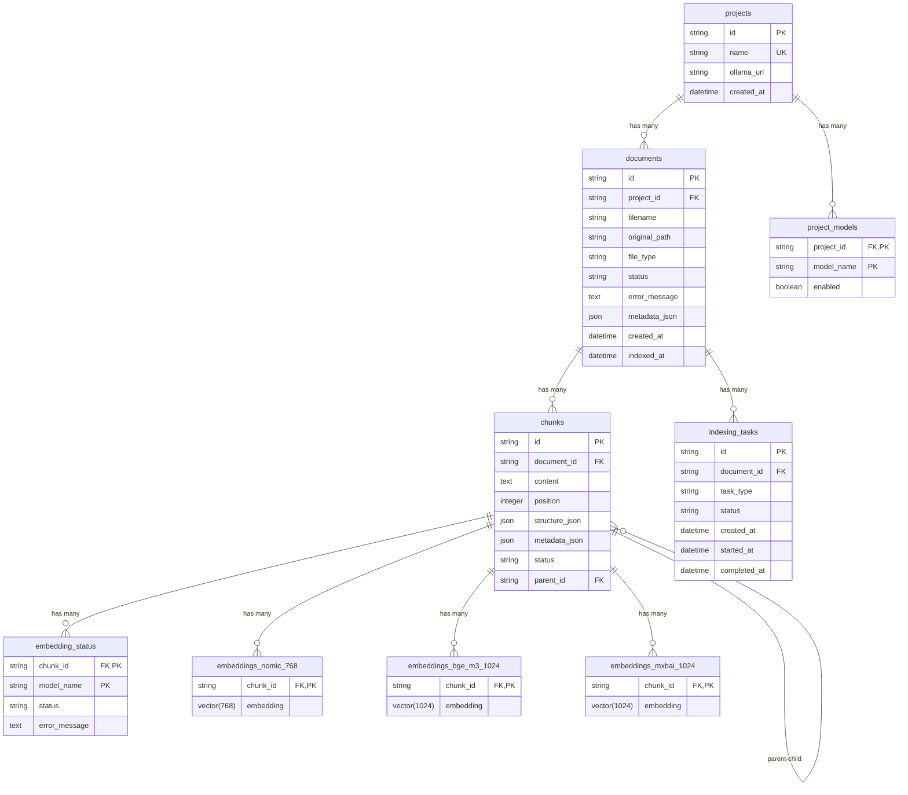

# miRAGe

> **⚠️ Experimental Project**
>
> This is an experimental project to explore context engineering as a software development approach. It serves as a learning sandbox and is not intended for production use.
>
> **Status:** Experimental, work-in-progress. APIs and architecture may change.
>
> Development powered by:
> - [z.ai GLM-5](https://z.ai/)
> - [Claude Code](https://claude.ai/code)
> - [Crush](https://crush.dev/)
> - [skills.sh](https://skills.sh)
> - [Superpowers Skills](https://skills.sh/obra/superpowers/)

Local RAG system for books and documentation. Supports PDF, EPUB, and Markdown files with vector search powered by pgvector and Ollama embeddings.

## Features

- REST API for managing projects and documents
- Vector search using pgvector (PostgreSQL)
- Local embeddings via Ollama (supports multiple models per project)
- Supports PDF, EPUB, Markdown
- Multi-model embeddings: use different embedding models for different projects
- Parent-child chunking: small searchable chunks with large context windows

## Supported Embedding Models

miRAGe supports three embedding models with different strengths:

| Model | Dimensions | Context | Languages | Speed | Quality |
|-------|------------|---------|-----------|-------|---------|
| `nomic-embed-text` | 768 | 8192 | EN (best), others | Fast | Good |
| `bge-m3` | 1024 | 8192 | Multilingual (excellent) | Medium | Excellent |
| `mxbai-embed-large` | 1024 | 512 | EN (best), others | Fast | Excellent (short) |

**Recommendations:**
- **English documentation:** `bge-m3` + `nomic-embed-text`
- **Multilingual (RU/EN):** `bge-m3` only
- **High-volume indexing:** `nomic-embed-text` only
- **Quality comparison:** use all three models (default)

See [docs/supported_models.md](docs/supported_models.md) for detailed comparison.

## Quick Start

### Prerequisites

- Docker and Docker Compose
- [uv](https://github.com/astral-sh/uv) (optional, for running tests locally)

### Setup

```bash
# Start all services (DB, Ollama, API, Indexer)
make dev

# Download embedding model (first time only, ~670MB)
make ollama-pull
```

API will be available at http://localhost:8000

Live reload is enabled — edit `src/` and changes apply automatically.

### Verify Setup

```bash
# Check services are running
docker compose ps

# Check Ollama model is loaded
docker exec mirage-ollama ollama list

# Test embedding model
curl http://localhost:11434/api/embeddings -d '{
  "model": "mxbai-embed-large",
  "prompt": "Hello world"
}'

# Test API health
curl http://localhost:8000/health
```

## CLI

The `mirage` CLI is a thin client to the API. Copy the example env file and fill in values:

```bash
cp .env.example .env
```

Or export variables directly:

```bash
export MIRAGE_API_URL=http://localhost:8000/api/v1
export MIRAGE_API_KEY=dev-api-key
```

### Projects

```bash
# Create a project (uses all available models by default)
mirage projects create my-docs

# Create a project with specific embedding models
mirage projects create my-docs --model nomic-embed-text --model bge-m3

# Create a project with custom Ollama URL
mirage projects create my-docs --ollama-url http://custom-ollama:11434

# List projects (shows models configured for each)
mirage projects list

# Delete a project
mirage projects delete <project_id>
```

### Documents

```bash
# List documents in a project
mirage documents list --project my-docs

# Upload a document
mirage documents add --project my-docs /path/to/book.pdf

# Check document status
mirage documents status --project my-docs <document_id>

# Remove a document
mirage documents remove --project my-docs <document_id>
```

### Search

```bash
# Search across project documents
mirage search --project my-docs "machine learning basics"

# Limit number of results
mirage search --project my-docs "neural networks" --limit 5

# Set minimum similarity threshold (default: 0.3)
mirage search --project my-docs "deep learning" --threshold 0.5

# Filter by specific embedding models
mirage search --project my-docs "ai concepts" --model nomic-embed-text
mirage search --project my-docs "ai concepts" --model nomic-embed-text --model bge-m3
```

### Other

```bash
# Show version
mirage --version

# Show help
mirage --help
mirage documents --help
```

## End-to-End Test

A sample book (*The Art of War* by Sun Tzu, public domain) is included in `samples/`.

The script `scripts/first-test.sh` creates a project, uploads the sample document, and checks its status:

```bash
#!/usr/bin/env bash
set -euo pipefail
set -x

SCRIPT_DIR="$(cd "$(dirname "$0")" && pwd)"
PROJECT_ROOT="$SCRIPT_DIR/.."
DOCUMENT_PATH="${1:-$PROJECT_ROOT/samples/the-art-of-war.epub}"
PROJECT_NAME="test-project"

MIRAGE="uv run --project $PROJECT_ROOT mirage"

PROJECT_ID=$($MIRAGE projects create "$PROJECT_NAME" | awk '{print $NF}')
DOC_ID=$($MIRAGE documents add --project "$PROJECT_ID" "$DOCUMENT_PATH" | head -1 | awk '{print $NF}')
$MIRAGE documents status --project "$PROJECT_ID" "$DOC_ID"
$MIRAGE documents list --project "$PROJECT_ID"
```

Run it:

```bash
# Uses the bundled sample book
./scripts/first-test.sh

# Or specify your own document
./scripts/first-test.sh /path/to/document.pdf
```

## API Usage

For raw HTTP API examples (curl), see [docs/raw-api.md](docs/raw-api.md).

## Development Commands

| Command | Description |
|---------|-------------|
| `make dev` | Start all services (DB, Ollama, API, Indexer) |
| `make dev-stop` | Stop all services |
| `make dev-logs` | Show service logs |
| `make dev-build` | Rebuild Docker images |
| `make test` | Run tests locally |
| `make setup` | Install Python dependencies (for local testing) |
| `make ollama-pull` | Download embedding model |
| `make db-shell` | Open PostgreSQL shell |
| `make clean` | Stop services and remove volumes |

## Configuration

Environment variables (set in docker-compose.yml):

| Variable | Default | Description |
|----------|---------|-------------|
| `MIRAGE_DATABASE_URL` | - | PostgreSQL connection string |
| `MIRAGE_API_KEY` | - | API authentication key |
| `MIRAGE_OLLAMA_URL` | `http://ollama:11434` | Default Ollama server URL |
| `MIRAGE_CHUNK_SIZE` | `3000` | Parent chunk size (chars) |
| `MIRAGE_CHUNK_OVERLAP` | `200` | Parent chunk overlap |
| `MIRAGE_CHILD_CHUNK_SIZE` | `500` | Child chunk size |
| `MIRAGE_CHILD_CHUNK_OVERLAP` | `50` | Child chunk overlap |
| `MIRAGE_DOCUMENTS_PATH` | `/data/documents` | Document storage path |

**Embedding models** are configured per-project via API/CLI (`--model` flag), not via environment variables. Each project can use multiple models simultaneously and can override the default Ollama URL.

## Architecture

```
┌─────────────────────────────────────────────────────────────┐
│                   k3s cluster (namespace: mirage)           │
│                                                             │
│  ┌──────────────┐    ┌──────────────┐    ┌──────────────┐   │
│  │   miRAGe     │    │   miRAGe     │    │   Ollama     │   │
│  │     API      │───▶│   Indexer    │───▶│  (embeddings)│   │
│  └──────┬───────┘    └──────┬───────┘    └──────────────┘   │
│         │                   │                               │
│         ▼                   ▼                               │
│  ┌─────────────────────────────────────────────┐            │
│  │      PostgreSQL + pgvector                  │            │
│  │                                             │            │
│  │  ┌─────────┐  ┌──────────────────────────┐  │            │
│  │  │ chunks  │──┤ embeddings_nomic_768     │  │            │
│  │  │ (no     │  │ embeddings_bge_m3_1024   │  │            │
│  │  │ vector) │  │ embeddings_mxbai_1024    │  │            │
│  │  └─────────┘  └──────────────────────────┘  │            │
│  │  ┌─────────┐  ┌──────────────────────┐      │            │
│  │  │ tasks   │  │ project_models       │      │            │
│  │  │ (queue) │  │ embedding_status     │      │            │
│  │  └─────────┘  └──────────────────────┘      │            │
│  │  ┌─────────┐                                │┌──────────┐│
│  │  │ docs    │                                ││   PV     ││
│  │  │ meta    │                                ││ (files)  ││
│  │  └─────────┘                                │└──────────┘│
│  └─────────────────────────────────────────────┘            │
└─────────────────────────────────────────────────────────────┘
         ▲
         │ API Key auth
         │
┌────────┴────────┐
│  Claude Code    │
│  + miRAGe skill │
│  + CLI          │
└─────────────────┘
```

**Components:**
- **API** — FastAPI, document CRUD, search, authentication
- **Indexer** — ChunkWorker, MultiModelEmbeddingWorker, StatusWorker (all run concurrently)
- **PostgreSQL + pgvector** — metadata and vector storage
- **Ollama** — local embeddings (supports multiple models per project)
- **PV** — original file storage

**Database Schema (multi-model):**
- `chunks` — text chunks without embeddings (separate storage)
- `embeddings_nomic_768` — 768-dimension vectors
- `embeddings_bge_m3_1024` — 1024-dimension vectors
- `embeddings_mxbai_1024` — 1024-dimension vectors
- `project_models` — per-project model configuration
- `embedding_status` — track embedding progress per chunk/model

**ERD Diagram:**



**Data flows:**
- **Add document:** CLI → API → file to PV → ChunkWorker parses → creates parent + child chunks → embedding_status rows per model → MultiModelEmbeddingWorker embeds child chunks → StatusWorker marks ready
- **Search:** CLI → API → query embedding with all enabled models (parallel) → vector search child chunks → fetch parent content → deduplicate by chunk_id → ranked results

## Multi-Model Embeddings

miRAGe supports using multiple embedding models simultaneously:

**Per-Project Configuration:**
- Each project specifies which models to use via `--model` flag
- Default: all three models enabled
- Custom Ollama URL per project (for distributed deployments)

**Database Storage:**
- Separate embeddings tables per model (`embeddings_nomic_768`, `embeddings_bge_m3_1024`, `embeddings_mxbai_1024`)
- `embedding_status` table tracks progress per chunk per model
- `project_models` table stores project-level model configuration

**Indexing:**
- All enabled models index documents in parallel
- StatusWorker marks chunk ready only when all models have embeddings

**Search:**
- Queries all enabled models in parallel
- Results deduplicated by chunk_id (keeps minimum distance)
- Can filter by specific models with `--model` flag

**Search Algorithm:**
1. Get enabled models for the project
2. Embed the query with each enabled model (parallel requests)
3. For each model: execute vector search on corresponding `embeddings_{model}` table to find top-k matches
4. Union all results from all enabled models
5. Deduplicate by `chunk_id` — if the same chunk appears in multiple models' results, keep the entry with the minimum distance
6. Sort all deduplicated results by distance (ascending)
7. Limit to final k results
8. Join with `chunks` table to get content and `parent_content`
9. Return ranked results with metadata

**Why keep minimum distance?**
- Same chunk may rank differently across models
- Minimum distance = highest similarity = best match
- Ensures quality regardless of which model found it

**Benefits:**
- Compare search quality across models
- Use model-specific strengths (multilingual vs fast vs accurate)
- Future A/B testing capabilities

## Parent-Child Chunking

miRAGe uses a two-level chunking strategy for better retrieval quality:

**Parent Chunks (3000 chars):**
- Large context windows preserving document structure
- Not embedded directly (storage optimization)
- Provide full context for search results

**Child Chunks (500 chars):**
- Small, focused chunks for semantic search
- Embedded and indexed in vector tables
- Link to parent chunk via `parent_id`

**Search Flow:**
1. Query embedded → search child chunks → retrieve closest matches
2. For each result → fetch parent content via `parent_id`
3. Return child chunk with parent context for better comprehension

**Benefits:**
- Precise semantic search (small chunks)
- Rich context in results (large parents)
- Reduced embedding computation (only child chunks embedded)
- Better document structure preservation

## Project Status

- [x] Phase 1: Foundation (config, db, embedding client)
- [x] Phase 2: API (projects, documents, search endpoints)
- [x] Phase 3: Indexer (document parsing, chunking, embedding)
- [x] Phase 3.5: Chunk Status (per-chunk embeddings, progress tracking)
- [x] Phase 4: CLI integration
- [ ] Phase 5: Infrastructure (Docker, Helm, migrations)

## License

MIT
